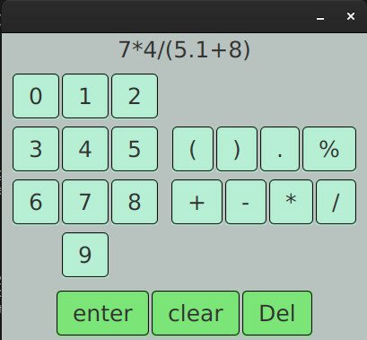

# Calculator

## Table of content
* [Description of the project](#description-of-the-project)
  * [Goal of the project](#goal-of-the-project)
  * [Technologies used](#technologies-used)
* [How to run the calculator](#how-to-run-the-calculator)
* [Want to change the code ?](#want-to-change-the-code-?)
  * [Want to improve the existing code ?](#want-to-improve-the-existing-code-?)
  * [How to add function to the calculator via ANTLR](#how-to-add-function-to-the-calculator)
* [Features to add in future](#features-to-add-in-future)
* [Project structure](#project-structure)
* [License & copyrights](#licence)

<a name="description-of-the-project"></a>
## Description of the project
This project is a very light calculator that can do basic arithmical operations. This project was build in a way to be robust to changements.



<a name="goal-of-the-project"></a>
### Goal of this project
I spend some time without coding so I made this project to see what I can do and to get back on tracks by baby steps before doing bigger personal projects.
The main goal of this project was still to betteren myself with tests.

<a name="technologies-used"></a>
### Technologies used
Here are the technologies used for this project :
  - Java Fxml
  - [maven](https://maven.apache.org/)
  - [ANTLR4](https://www.antlr.org/)

<a name="how-to-run-the-calculator"></a>
## How to run the calculator
- You first have to [download and install Maven](https://maven.apache.org/download.cgi) if you haven't done it already in order to launch the project.
- Then you can open a terminal and build the project with the following command : 
```bash
 mvn package 
 ```
- You can finally run the project with :
```bash
 mvn javafx:run
```

<a name="want-to-change-the-code-?"></a>
## Want to change the code ?

<a name="how-to-add-function-to-the-calculator"></a>
### How to add function to the calculator via ANTLR :

If you want to add functions to calculator (like cos/sin/tan as unary functions), you have to follow these steps :
 - Update the gramar of the calculator in the file  `./src/main/antlr4/antlr/MathExpr.g4`
 - Use <abbr title="Another Tool for Language Recognition">ANTLR4</abbr>-maven-plugin via the command `$mvn generate-sources` to generate the Lexer, Parser and Visitor files associated to your new grammar.
 - Replace the file of the repository  *src/main/java/me/calculator/model/antlr/generated* by the files previously generated (if you don't want to manually update packages names, place a header tag in the grammar).
 - Update the AbstractSyntaxTreeVisitor and AbstractSyntaxTreeBuilder files in src/main/java/me/calculator/model/antlr folder.

<a name="want-to-improve-the-existing-code-?"></a>
### Want to improve the existing code ?
You already have read my code. You have some time to share with me and you think that some parts of my code stink and can be improved ? Please fire an issue to tell me where and how you would betteren my code.

<a name="features-to-add-in-future"></a>
## Features to add in future.
  - **View :**
    - Make nested fxml for numeric/operation pads in view
    - Bind every button with it's associated key properly.
    - Add Buttons to navigate into the mathematical expression with horizontal key
    - Add Buttons to store all previous mathematical expression in a history with vertical key
  - **Controller :**
    - Test the view with testFx or something else.
  - **Tests :**
    - Refactor existing test properly and update it with use of Mokito to respect F.I.R.S.T principle.
  - **Model :**
    - Implement a better error management for the lexer and te parser that differenciate Syntax errors and Semmentical ones.
    - Remove print of Parser and Lexer error messages into the console.
  - **Fix**
    - Fix the error when ìmput is like ` x + .y ` in the grammar
<a name="project-structure"></a>
## Project structure
```bash
.
├── pom.xml
├── readme
├── README.md
└── src
    ├── main
    │   ├── antlr4
    │   │   └── antlr
    │   │       └── MathExpr.g4
    │   ├── java
    │   │   ├── me
    │   │   │   └── calculator
    │   │   │       ├── App.java
    │   │   │       ├── controller
    │   │   │       │   ├── CalculatorController.java
    │   │   │       │   └── TokensList.java
    │   │   │       └── model
    │   │   │           ├── antlr
    │   │   │           │   ├── AbstractSynaxTreeVisitor.java
    │   │   │           │   ├── generated
    │   │   │           │   │   ├── MathExprBaseVisitor.java
    │   │   │           │   │   ├── MathExpr.interp
    │   │   │           │   │   ├── MathExprLexer.interp
    │   │   │           │   │   ├── MathExprLexer.java
    │   │   │           │   │   ├── MathExprLexer.tokens
    │   │   │           │   │   ├── MathExprParser.java
    │   │   │           │   │   ├── MathExpr.tokens
    │   │   │           │   │   └── MathExprVisitor.java
    │   │   │           │   └── ParseTreeBuilder.java
    │   │   │           └── Calculator.java
    │   │   └── module-info.java
    │   └── resources
    │       └── me
    │           └── calculator
    │               ├── calculator.css
    │               └── calculator.fxml
    └── test
        └── java
            └── me
                └── calculator
                    ├── controller
                    │   └── TokensListTest.java
                    └── model
                        ├── antlr
                        │   ├── AbstractSynaxTreeVisitorTest.java
                        │   └── ParseTreeBuilderTest.java
                        └── CalculatorTest.java
```
<a name="licence"></a>
## License & copyrights

This project is aviable under the [MIT License](./readme/licence)